# deeplearning_tutorial

## Syllabus
1. Machine Learning Basic
2. Neural Network & Training Techniques
3. Convlutional Neural Network & Recurrent Neural Network
4. Detection & Segmentation ( Yolo2 )
5. Reinforcement Learning ( DQN & gym )
6. Reinforcement Learning ( A3C )
7. Generative Model ( Auto-encoder & GAN & DCGAN )
8. Jetson TX2 setup & Test TensorRT
9. Paper Review

## Docker Setup
### Docker on Ubuntu with CPU
```
docker run --name pytorch --rm \
    -v "/tmp/.X11-unix:/tmp/.X11-unix:rw" \
    -v "$HOME/.Xauthority:/root/.Xauthority:rw" \
    -e QT_X11_NO_MITSHM=1 \
    -e DISPLAY=$DISPLAY \
    -p 8888:8888 \
    --net=host \
    --mount 'type=bind,src=/home/ghryou/Workspace/deeplearning_tutorial,dst=/app' \
    -it ghryou/pytorch:cpu bash

jupyter notebook --allow-root
```

### Docker on Ubuntu with GPU
```
docker run --name pytorch --rm \
   --runtime=nvidia \
   -v "/tmp/.X11-unix:/tmp/.X11-unix:rw" \
   -v "$HOME/.Xauthority:/root/.Xauthority:rw" \
   -e QT_X11_NO_MITSHM=1 \
   -e DISPLAY=$DISPLAY \
   --net=host \
   --mount 'type=bind,src=/home/naverlabs/Workspace/deeplearning_tutorial,dst=/app' \
   -it ghryou/pytorch:gpu bash​
```

### Docker on Windows
1. setup shared memory at docker settings
Right click docker icon -> Settings -> Shared Drives -> Check C Drive -> Apply -> Type password -> Restart docker

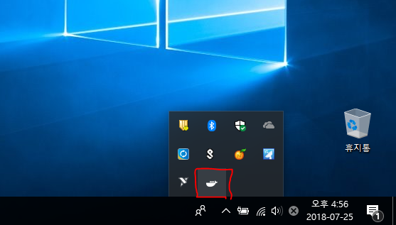
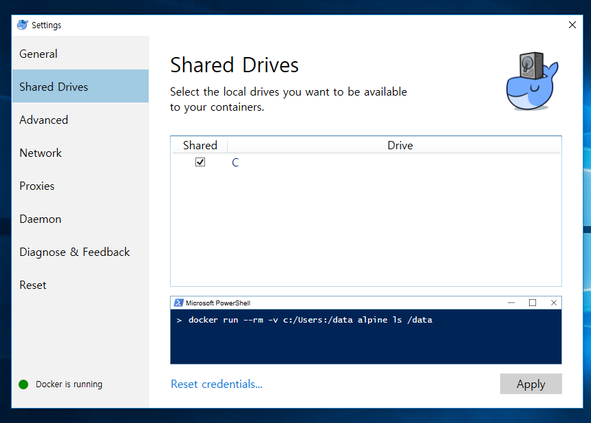
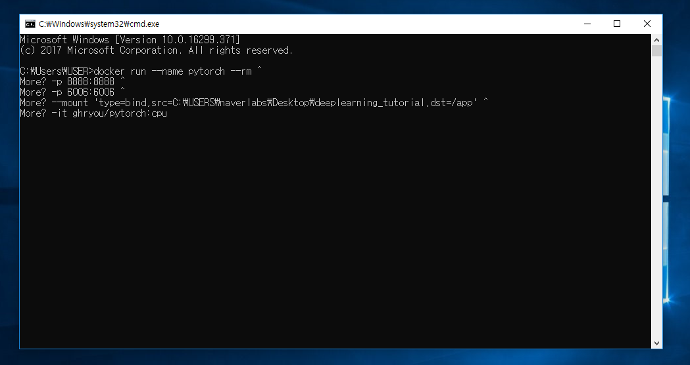
2. Install [Xming X Server](https://sourceforge.net/projects/xming/)
3. Follow [this link](https://blogs.msdn.microsoft.com/jamiedalton/2018/05/17/windows-10-docker-gui/) to setup Xming X Server

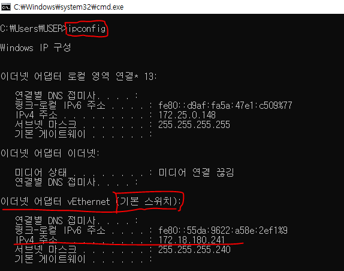
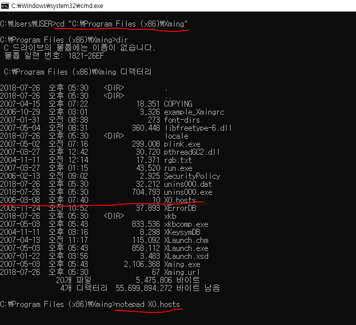
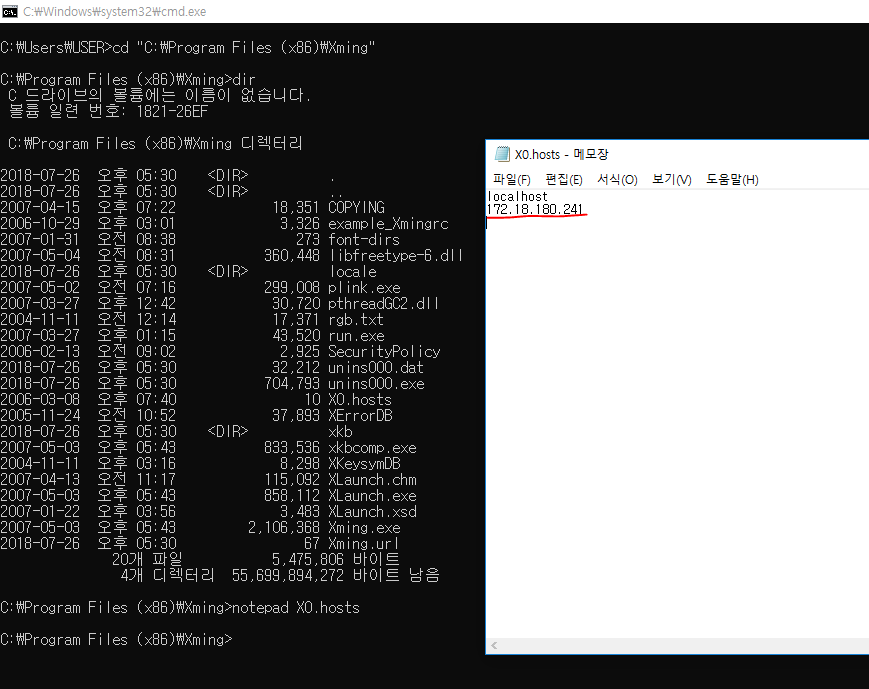
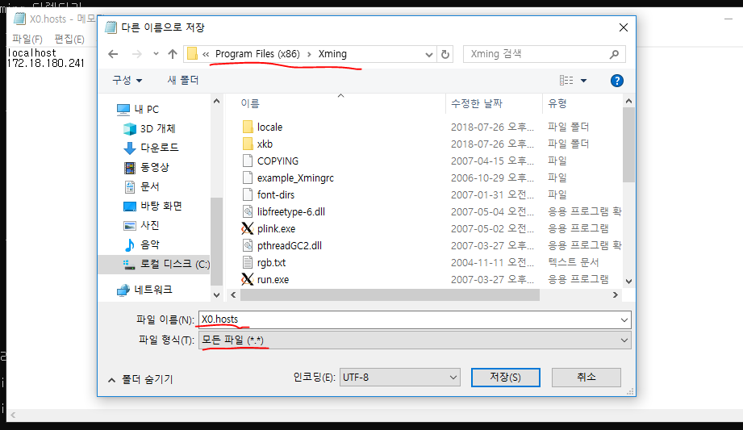
4. Run Xming
5. Open windows 10 powershell & Run this code
```
docker run --name pytorch --rm `
-p 8888:8888 `
-p 6006:6006 `
-e DISPLAY:<IP_Address>:0 `
--mount type=bind,src=C:\USERS\naverlabs\Desktop\deeplearning_tutorial,dst=/app `
-it ghryou/pytorch:cpu bash​
```

### Docker on Mac
1. Install [homebrew](https://brew.sh/index_ko)
2. brew install xquartx
3. Follow [this link](https://sourabhbajaj.com/blog/2017/02/07/gui-applications-docker-mac/) for X11 security Setup
4. Run this code
```
open -a XQuartz
./docker/run.mac.sh ghryou/pytorch:cpu bash
```

### Ubuntu Commands
```
sudo chown <User name> -R <directory path>
```

### Docker Cheat Sheet
```
docker build -t <tag name> -f <Dockerfile path> <Dockerfile directory>
docker exec -it pytorch bash
docker images
docker ps -al
docker stop <image id>
docker rmi <image id>
docker system prune
```

[Push images to Docker Cloud](https://docs.docker.com/docker-cloud/builds/push-images/)

### Jetson Setup
1. Download JetPack from [Nvidia website](https://developer.nvidia.com/embedded/jetpack)
2. Makes run files executable with **sudo chmod +x JetPack-L4T-3.3-linux-x64_b39.run**
3. Run **./JetPack-L4T-3.3-linux-x64_b39.run**
4. Follow the Commands of JetPack Installer (Install every package)
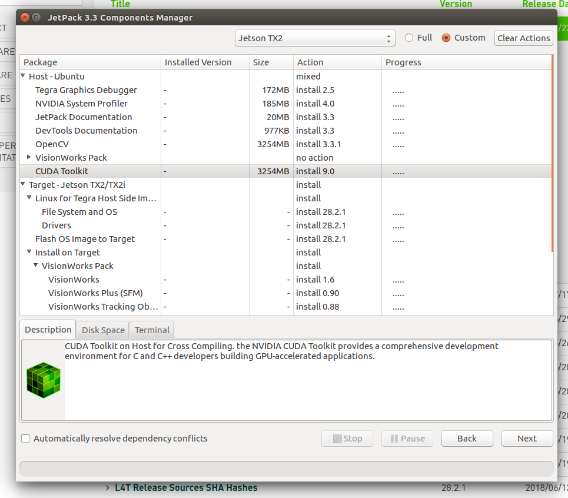
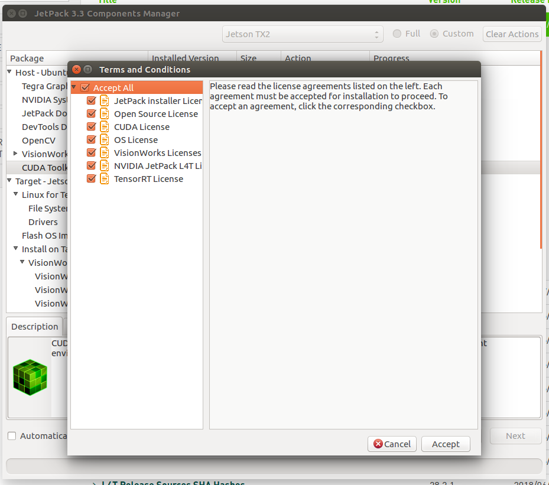
5. Select **Device accesses Internet via Router/Switch**
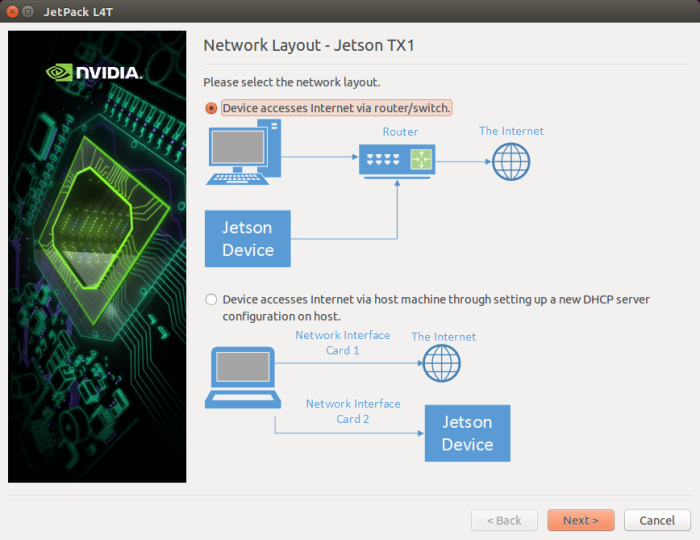
6. Connect jetson with host PC and follow the instructions
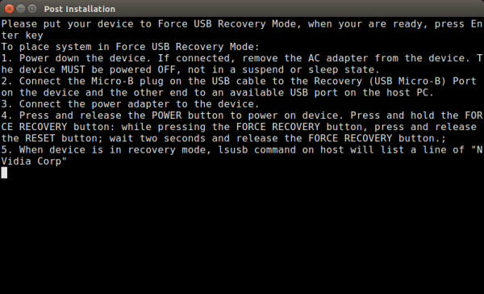
7. Connect display to jetson and setup internet connection on jetson
8. Check IP address of jetson with **ifconfig**
9. Run **./JetPack-L4T-3.3-linux-x64_b39.run** again
10. Disable **Flash OS Image to Target**
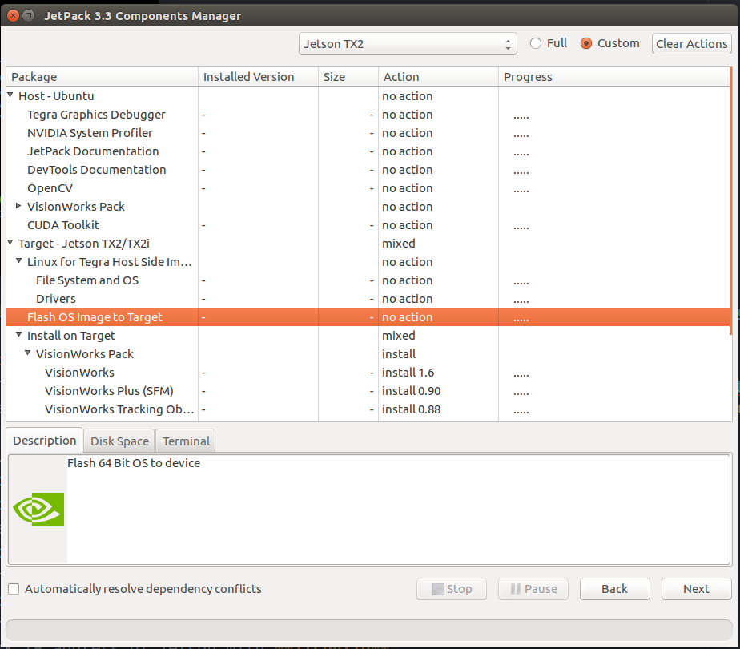
11. Select **Device accesses Internet via Router/Switch**

12. Enter jetson's IP address and follow the instructions

### Jetson Pytorch Setup
1. Install pip3
```
sudo apt-get update && sudo apt-get upgrade
sudo apt-get install python3-pip
pip3 install -U pip3
```
2. clone pyTorch repo
```
git clone http://github.com/pytorch/pytorch
cd pytorch
git submodule update --init
```
3. install prereqs
```
sudo pip3 install -U setuptools
sudo pip3 install -r requirements.txt
```
4. Develop Mode:
```
python3 setup.py build_deps
sudo python3 setup.py develop
```
5. Verify CUDA (from python3 interactive terminal)
```
import torch
print(torch.__version__)
print(torch.cuda.is_available())
```

Reference: https://gist.github.com/dusty-nv/ef2b372301c00c0a9d3203e42fd83426
